# MISC
## Sanity
Check the rules channel of the Discord Server. <br>
<br>

**FLAG**: WannaHack{y0u_4r3_54n3_6969}<br>

## Impossible
```python
#! /bin/python3

flag = open('/flag.txt').read()

while True:
    s = input("Enter the string: ")
    if len(s) >= 20:
        print("String too long!!")
        print()
    elif len(s.upper()) < 25:
        print("String too short!!")
        print()
    elif len(s.upper()) > 25:
        print("String too long!!")
        print()
    else:
        print(f"Well done! FLAG: {flag}")
        break

```

We are supposed to enter a string which has length less than 20 and after using the upper() method the length equal to 25. The german character "ß" will do the work.<br>
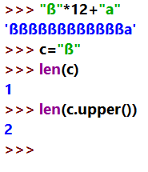<br>
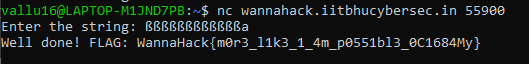<br>
**FLAG**: WannaHack{m0r3_l1k3_1_4m_p0551bl3_0C1684My}

## Sanity 2
Search ```WannaHack{``` in discord server and look into the memes page.<br>
<br>

**FLAG**: WannaHack{d15c0rd_15_4_5c4ry_b3457_6969}

## Colourful Image
Look for "npiet" decoder. The hint was the name given in the chall "piet". <br>
https://www.bertnase.de/npiet/npiet-execute.php<br>
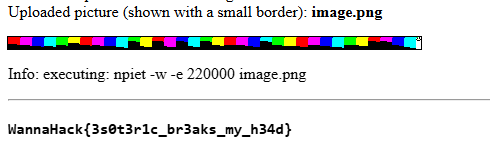<br>

**FLAG**: WannaHack{3s0t3r1c_br3aks_my_h34d}

## Sanity 3
Download the plugins required in discord to look for hidden channels and enable them.<br>
The flag is divided into two parts. The first part is highlighted with red and the second with green.<br>
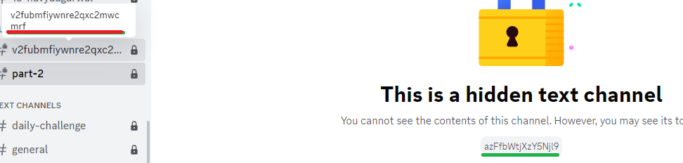<br>
Convert them from base64 by bruteforcing it some letters into uppercase.<br>
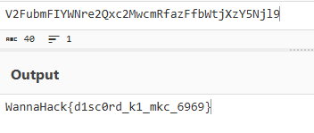<br>

**FLAG**: WannaHack{d1sc0rd_k1_mkc_6969}

# FORENSICS
## Least Significant Clue
Look for online steganographyb tool and decode the image.<br>
https://stylesuxx.github.io/steganography/<br>
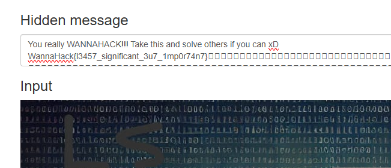<br>

**FLAG**: WannaHack{l3457_significant_3u7_1mp0r74n7}

## Secret Chat
Use the "tshark" command to get a list of readable strings. The last one is the flag cinverted in base64.<br>
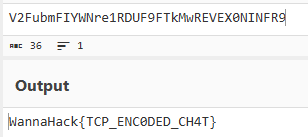<br>
**FLAG**: WannaHack{TCP_ENC0DED_CH4T}

## RickRoll Resonance
Search online for audio spectograms and observe.<br>
https://convert.ing-now.com/audio-spectrogram-creator/<br>


**FLAG**: 

## Cracking the Stream
After using the usual binwalk command we get to know about the zip file. Extract it and get a password protected flag.txt file.<br>
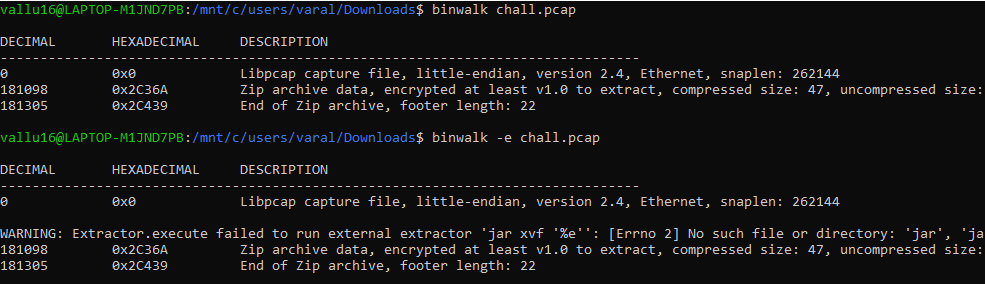<br>
The question hints to use ROCKyou.txt file to get the password.<br>
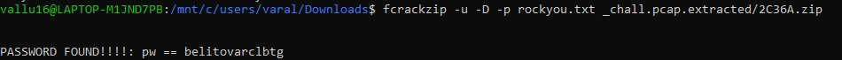<br>

    fcrackzip -u -D -p rockyou.txt _chall.pcap.extracted/2C36A.zip
    PASSWORD FOUND!!!!: pw == belitovarclbtg

Enter the password and get the flag.<br>

**FLAG**: WannaHack{F0ll0w_7he_H77P_S7ream5}

## Kitty's Friend
<br>
Count the number of dashes and map them to alphabets.<br>

    1 -> a
    2-> b
    and so on..

    username: "slimesan"

Search the username in pastebin and reverse the string to get the flag.<br>
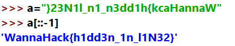<br>

**FLAG**: WannaHack{h1dd3n_1n_l1N32}

## The Turings Challenge
Ise enigma decoder online and enter the details given in the question.<br>
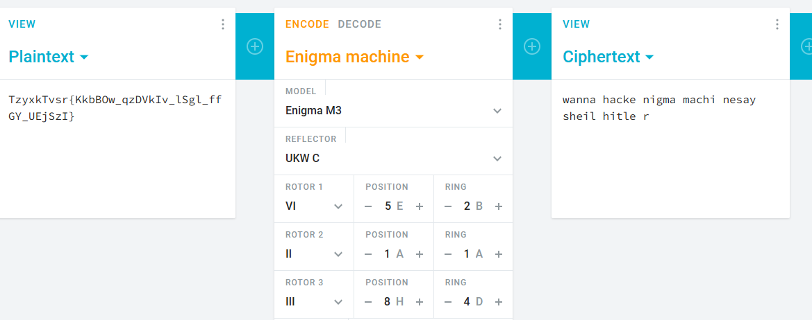<br>
Captilize the letters as given in the question.<br>

**FLAG**: WannaHack{EniGMa_maCHiNe_sAys_heIL_HItLeRr}

## more-soup-please
Find the .wav file headers and xor it with the output.<br>
```python
from pwn import xor

DATA = open('audio.wav', 'rb').read()
KEY = b'FAKE_KEY'       #I used the name of my favourite soup as the key. Good luck finding that out

print(xor(DATA, KEY))
```
After xoring, we'll get the KEY as "TOMATO_SOUP".
Take this KEY and xor with the output.txt to get a audiofile.
```python
def xor(data, key):
    """XOR operation between data and a repeating key."""
    return bytes([data[i] ^ key[i % len(key)] for i in range(len(data))])

#Load encrypted data from output.txt
with open("output.txt", "rb") as file:
    encrypted_data = file.read()

KEY = "TOMATO_SOUP"

# Attempt decryption using each soup name
decrypted_data = xor(encrypted_data, KEY)
print(decrypted_data)
with open("decoded_audio.wav", "wb") as f:
    f.write(decrypted_data)
```
The audio has morse code converted. Check for an online site and convert it to get the flag.<br>
https://morsecode.world/international/decoder/audio-decoder-adaptive.html<br>

**FLAG**: WannaHack{YAYILOVEMORESOUP}

## Easy Cat
Use nc command as given.<br>
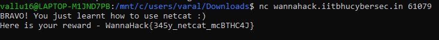<br>

**FLAG**: WannaHack{345y_netcat_mcBTHC4J}

## Cheap Amazon
```c
#include <stdio.h>
#include <stdlib.h>

int main(){
    setbuf(stdout, NULL);
    int balance = 1000;
    int money = 0;
    printf("Welcome! Buy whatever you want, but remember to check your balance.\n");
    while(1){
        printf("\n");
        printf("Money in pocket: %d\n", money);
        printf("Current Amazon Balance: %d\n", balance);
        printf("1. Withdraw\n");
        printf("2. Deposit\n");
        printf("3. Buy flag (PRICE: 1000000)\n");
        printf("4. Exit\n");
        int input;
        int option;
        printf("Option: ");
        scanf("%d", &option);
        if(option == 1){
            printf("Enter amount of money to withdraw: ");
            scanf("%d", &input);
            if(input <= balance) {
                balance -= input;
                money += input;
            }
            else {
                printf("Not enough balance!\n");
                continue;
            }
        }
        else if(option == 2){
            printf("Enter amount of money to deposit: ");
            scanf("%d", &input);
            if(input <= money) {
                balance += input;
                money -= input;
            }
            else {
                printf("Not enough money!\n");
                continue;
            }
        }
        else if(option == 3){
            if(money < 1000000) printf("Not enough money!\n");
            else {
		system("cat /flag.txt");
                return 0;
            }
        }
        else if(option == 4){
            return 0;
        }
        else{
            printf("Not a valid option!");
        }
    }
    return 0;
}
```
Integer overflow concept will be used to increase the money in pocket.<br>
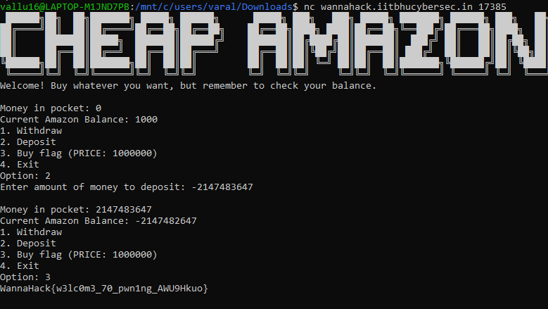<br>

**FLAG**: WannaHack{w3lc0m3_70_pwn1ng_AWU9Hkuo}

## Cheap Amazon Revenge
```c
#include <stdio.h>
#include <stdlib.h>

int main(){
    setbuf(stdout, NULL);
    int balance = 1000;
    int money = 0;
    printf("Welcome! Buy whatever you want, but remember to check your balance.\n");
    while(1){
        printf("\n");
        printf("Money in pocket: %d\n", money);
        printf("Current Amazon Balance: %d\n", balance);
        printf("1. Withdraw (number of Rs. 100 gift cards)\n");
        printf("2. Deposit (number of Rs. 100 gift cards) \n");
        printf("3. Buy flag (PRICE: Rs. 1000000)\n");
        printf("4. Exit\n");
        int input;
        int option;
        printf("Option: ");
        scanf("%d", &option);
        if(option == 1){
            printf("Enter number of Rs. 100 gift cards to withdraw: ");
            scanf("%d", &input);
	   if(input < 0) {
		   printf("Hehe this was patched!");
		   continue;
	   }
	   input = input * 100;
            if(input <= balance) {
                balance -= input;
                money += input;
            }
            else {
                printf("Not enough balance!\n");
                continue;
            }
        }
        else if(option == 2){
            printf("Enter number of Rs. 100 gift cards to deposit: ");
            scanf("%d", &input);
	   if(input < 0) {
		   printf("Hehe this was patched!");
		   continue;
	   }
	   input = input * 100;
            if(input <= money) {
                balance += input;
                money -= input;
            }
            else {
                printf("Not enough money!\n");
                continue;
            }
        }
        else if(option == 3){
            if(money < 1000000) printf("Not enough money!\n");
            else {
		system("cat /flag.txt");
                return 0;
            }
        }
        else if(option == 4){
            return 0;
        }
        else{
            printf("Not a valid option!");
        }
    }
    return 0;
}
```
Use integer overflow to increase the amount and get the flag.<br>
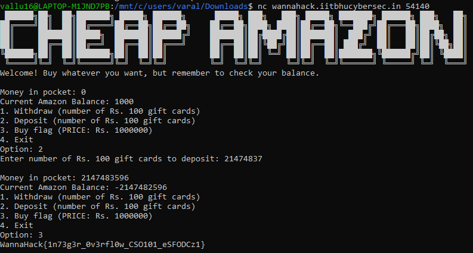<br>

**FLAG**: WannaHack{1n73g3r_0v3rfl0w_CSO101_eSFODCz1}

## Admin Ascent
Use ghidra to understand the code. The admin password is randomly generated so there's now way to get that but during comparison of the user and admin password the for loop is running till the smallest length of among the two. If the user password is of single character it is easy tobruteforce and set the user privileges as admin and get the password.<br>

```python
from pwn import *
r = remote('wannahack.iitbhucybersec.in', 51830)

for i in range(256):  
    r.sendline(b"1") 
    r.sendline(f"user{i}".encode())  
    r.sendline(bytes([i])) 
    
    r.recvuntil(b"Successfully Registered.") 
   
    r.sendline(b"2") 
   
    r.sendline(b"3") 
    flag = r.recvall() 
    print(f"Flag: {flag.decode()}") 
r.close() 
```

# OSINT

## Kimi No Sekai: Part 1
Place: Suga Shrine, Japan<br>
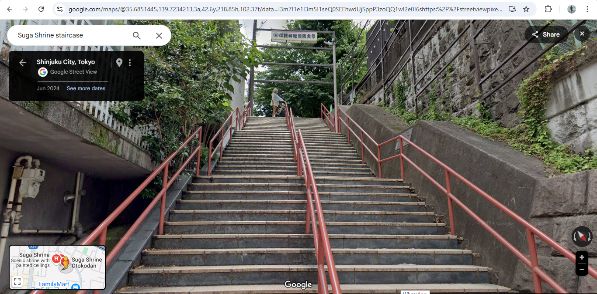<br>

**FLAG**: WannaHack{35.685144_139.723421}

## Kimi No Sekai: Part 2
Place: The National Art Center, Tokyo<br>
<br>

**FLAG**: WannaHack{35.664484_139.726985}

## Kimi No Sekai: Part 3
Place: Docomo Tower, Tokyo<br>
<br>

**FLAG**: WannaHack{35.684671_139.703933}

## Text First Search
Search the author's real name and get his JEE Advanced Roll no.<br>
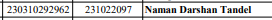<br>
**FLAG**: WannaHack{231022097}

# WEB
## Rules
Inspect the rules and find the flag.<br>
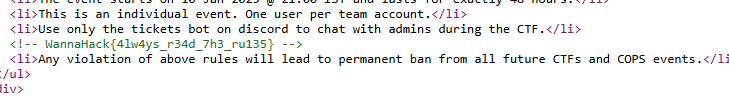<br>
**FLAG**: WannaHack{4lw4ys_r34d_7h3_ru135}

## Headers
Open burpsuite and change the headers as requested.<br>
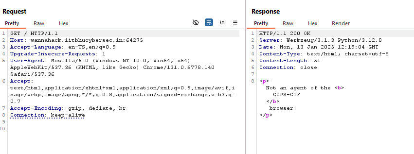<br>
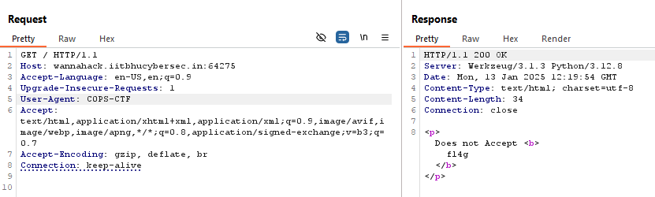<br>
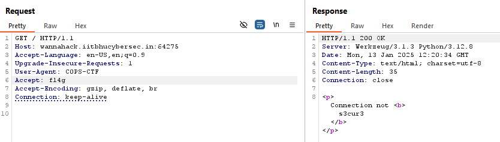<br>
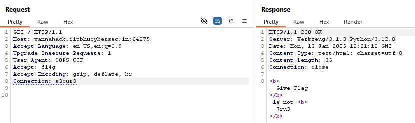<br>
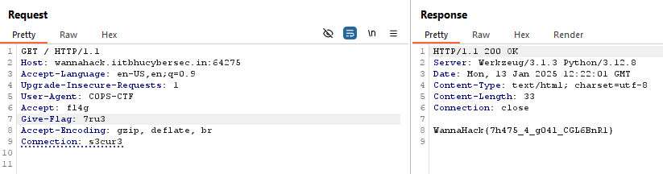<br>
**FLAG**: WannaHack{7h475_4_g04l_CGL6BnR1}

## Safest Bank in the World
Sign up as a user and make a transaction. Check for other transactions through url.<br>
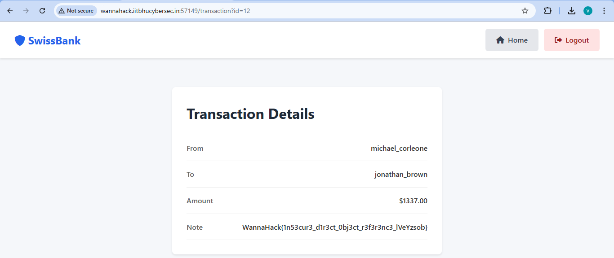<br>

**FLAG**: WannaHack{1n53cur3_d1r3ct_0bj3ct_r3f3r3nc3_lVeYzsob}

## The Social Network
Look into the pages of each hostel and check its format. Write the scraping code for each hostel and make sure you cover all the pages.<br>
The given code is for HOSTEL A.<br>
```python
import requests
from bs4 import BeautifulSoup
import json

base_url = "http://wannahack.iitbhucybersec.in:24771/hostel/A?page="

students_data = []
num = 0
page = 1
has_more_pages = True

try:
    while has_more_pages:
        
        url = f"{base_url}{page}"
        
        
        response = requests.get(url)
        response.raise_for_status() 

        soup = BeautifulSoup(response.text, "html.parser")

        table = soup.find("table")
        if not table:
            print("No table found on the page.")
            break

        rows = table.find_all("tr")
        
        if len(rows) <= 1:
            has_more_pages = False
            break

        for row in rows[1:]:  # Skip the first row (header)
            cols = row.find_all("td")
            if len(cols) >= 3:  # Ensure the row has the required columns
                student = {
                    "hostel": "Hostel A",
                    "name": cols[0].get_text(strip=True),
                    "email": cols[1].get_text(strip=True),
                    "room": int(cols[2].get_text(strip=True))
                }
                num += 1
                students_data.append(student)

        print(f"Page {page} scraped successfully.")
        page += 1

    json_file_path = "./hostel_a_students.json"
    with open(json_file_path, "w") as json_file:
        json.dump(students_data, json_file, indent=4)

    print(f"Data scraped and saved to {json_file_path}")
    print(f"Total number of records scraped: {num}")

except requests.exceptions.RequestException as e:
    print(f"Error fetching the URL: {e}")
except ValueError as e:
    print(f"Error processing the page: {e}")

```
Verify your data by pasting in your solution.<br>
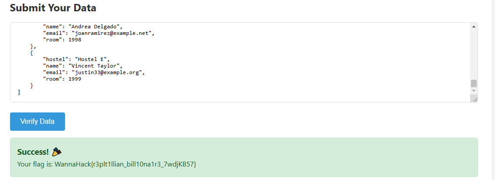<br>
 **FLAG**: WannaHack{r3plt1llian_bill10na1r3_7wdjKB57}

## Simple File Upload
Upload a random file and check the url.<br>
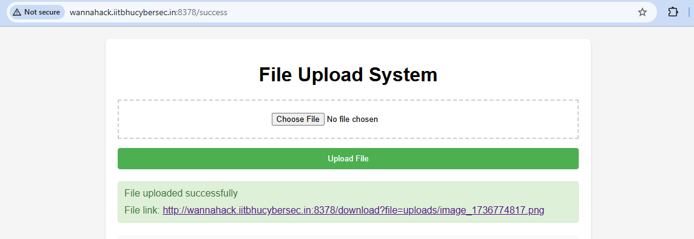<br>
Change the path to the root directory and access the flag.txt file.<br>
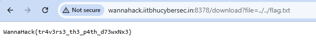<br>

# REV

## CrackMe
Use simple "strings" command to get the flag.<br>
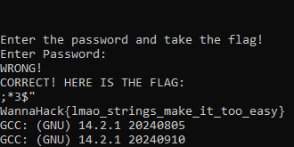<br>
**FLAG**: WannaHack{lmao_strings_make_it_too_easy}

## Simple Javascript
```js
const arr = [
  58, 14, 0, 5, 4, 49, 12, 12, 5, 16, 40, 74, 88, 90, 55, 52, 85, 65, 43,
  58, 91, 40, 81, 78, 94, 43, 49, 33, 80, 4,
];

const prefix = 'WannaHack{';

function reverseXORWithPrefix(arr, prefix) {
  let key = '';
  
  for (let i = 0; i < prefix.length; i++) {
    key += String.fromCharCode(arr[i] ^ prefix.charCodeAt(i));
  }

  return key;
}

const keyPart = reverseXORWithPrefix(arr, prefix);
console.log('Key Part:', keyPart);

function decryptFlagWithKey(arr, keyPart) {
  let fullKey = keyPart;
  
  
  while (fullKey.length < arr.length) {
    fullKey += fullKey; // Repeat the key
  }

  let flag = '';
  for (let i = 0; i < arr.length; i++) {
    flag += String.fromCharCode(arr[i] ^ fullKey.charCodeAt(i % fullKey.length));
  }

  return flag;
}

const flag = decryptFlagWithKey(arr, key);
console.log('Decrypted Flag:', flag);
```
Since we know the initials of our flag, we can try with them to get the key. The key is a repetition of "monkey". Saving the key and solving to get the flag.<br>
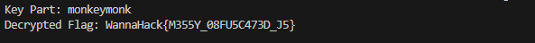<br>
**FLAG**: WannaHack{M355Y_08FU5C473D_J5}

# PPC 
## Easy Suduko
```python
from pwn import *
import re

def is_valid(board, r, c, num, rows, cols, boxes):
    return (num not in rows[r] and 
            num not in cols[c] and 
            num not in boxes[(r // 3) * 3 + c // 3])

def solve(board):
    def backtrack(board, rows, cols, boxes, choices):
        made_change = True
        while made_change:
            made_change = False
            for r in range(9):
                for c in range(9):
                    if board[r][c] == 0 and len(choices[r][c]) == 1:
                        num = choices[r][c].pop()
                        board[r][c] = num
                        rows[r].add(num)
                        cols[c].add(num)
                        boxes[(r // 3) * 3 + c // 3].add(num)
                        update_choices(r, c, num, choices)
                        made_change = True

        min_choices = 10 
        best_cell = None
        for r in range(9):
            for c in range(9):
                if board[r][c] == 0:
                    possible_choices = choices[r][c]
                    if len(possible_choices) < min_choices:
                        min_choices = len(possible_choices)
                        best_cell = (r, c)
        
        if best_cell is None:
            return True  
        
        r, c = best_cell
        for num in choices[r][c]:
            if is_valid(board, r, c, num, rows, cols, boxes):
                board[r][c] = num
                rows[r].add(num)
                cols[c].add(num)
                boxes[(r // 3) * 3 + c // 3].add(num)
                
                update_choices(r, c, num, choices)
                
                if backtrack(board, rows, cols, boxes, choices):
                    return True
                
                board[r][c] = 0
                rows[r].remove(num)
                cols[c].remove(num)
                boxes[(r // 3) * 3 + c // 3].remove(num)
                revert_choices(r, c, num, choices)
        
        return False

    def update_choices(r, c, num, choices):
        for nr in range(9):
            for nc in range(9):
                if board[nr][nc] == 0:
                    if num in choices[nr][nc]:
                        choices[nr][nc].remove(num)

    def revert_choices(r, c, num, choices):
        for nr in range(9):
            for nc in range(9):
                if board[nr][nc] == 0:
                    choices[nr][nc].add(num)

    rows = [set() for _ in range(9)]
    cols = [set() for _ in range(9)]
    boxes = [set() for _ in range(9)]

    choices = [[set(range(1, 10)) if board[r][c] == 0 else set() for c in range(9)] for r in range(9)]

    for r in range(9):
        for c in range(9):
            num = board[r][c]
            if num != 0:
                rows[r].add(num)
                cols[c].add(num)
                boxes[(r // 3) * 3 + c // 3].add(num)
            
                for nr in range(9):
                    for nc in range(9):
                        if board[nr][nc] == 0:
                            choices[nr][nc].discard(num)

    backtrack(board, rows, cols, boxes, choices)
    return board

def parse_sudoku(data):
    puzzle_start = data.find('>>') + 2
    puzzle_data = data[puzzle_start:].strip()
    puzzle_rows = puzzle_data.splitlines()
    sudoku = []
    for row in puzzle_rows:
        if not re.match(r"[0-9_ ]+$", row):
            continue
        row_data = [int(num) if num != '_' else 0 for num in row.split()]
        sudoku.append(row_data)
    return sudoku

def format_solution(board):
    return '\n'.join(' '.join(map(str, row)) for row in board)

def main():
    host = "wannahack.iitbhucybersec.in"
    port = 62511

    p = remote(host, port)
    
    score = 0

    while score <= 10:
        data = p.recv(4096).decode()
        print(data)

        if "Current Score:" in data:
            score_line = re.search(r"Current Score: (\d+)", data)
            if score_line:
                score = int(score_line.group(1))
            
            board = parse_sudoku(data)

            if board:
                solved_board = solve(board)
                solution = format_solution(solved_board)
                p.sendline(solution)

    flag = p.recv(4096).decode()
    print(flag)

if __name__ == "__main__":
    main()
```
Cinnect to the port and solve the sudukos..<br>
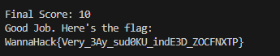<br>

**FLAG**: WannaHack{Very_3Ay_sud0KU_indE3D_ZOCFNXTP}

## Hard Suduko
Just like the previous suduko challenge wrute the script but this time with 1000 solves in one go.<br>
```python
from pwn import *
import re

def is_valid(board, r, c, num, rows, cols, boxes):
    return (num not in rows[r] and 
            num not in cols[c] and 
            num not in boxes[(r // 3) * 3 + c // 3])

def solve(board):
    def backtrack(board, rows, cols, boxes, choices):
        made_change = True
        while made_change:
            made_change = False
            for r in range(9):
                for c in range(9):
                    if board[r][c] == 0 and len(choices[r][c]) == 1:
                        num = choices[r][c].pop()
                        board[r][c] = num
                        rows[r].add(num)
                        cols[c].add(num)
                        boxes[(r // 3) * 3 + c // 3].add(num)
                        update_choices(r, c, num, choices)
                        made_change = True

        min_choices = 10 
        best_cell = None
        for r in range(9):
            for c in range(9):
                if board[r][c] == 0:
                    possible_choices = choices[r][c]
                    if len(possible_choices) < min_choices:
                        min_choices = len(possible_choices)
                        best_cell = (r, c)
        
        if best_cell is None:
            return True  
        
        r, c = best_cell
        for num in choices[r][c]:
            if is_valid(board, r, c, num, rows, cols, boxes):
                board[r][c] = num
                rows[r].add(num)
                cols[c].add(num)
                boxes[(r // 3) * 3 + c // 3].add(num)
                
                update_choices(r, c, num, choices)
                
                if backtrack(board, rows, cols, boxes, choices):
                    return True
                
                board[r][c] = 0
                rows[r].remove(num)
                cols[c].remove(num)
                boxes[(r // 3) * 3 + c // 3].remove(num)
                revert_choices(r, c, num, choices)
        
        return False

    def update_choices(r, c, num, choices):
        for nr in range(9):
            for nc in range(9):
                if board[nr][nc] == 0:
                    if num in choices[nr][nc]:
                        choices[nr][nc].remove(num)

    def revert_choices(r, c, num, choices):
        for nr in range(9):
            for nc in range(9):
                if board[nr][nc] == 0:
                    choices[nr][nc].add(num)

    rows = [set() for _ in range(9)]
    cols = [set() for _ in range(9)]
    boxes = [set() for _ in range(9)]

    choices = [[set(range(1, 10)) if board[r][c] == 0 else set() for c in range(9)] for r in range(9)]

    for r in range(9):
        for c in range(9):
            num = board[r][c]
            if num != 0:
                rows[r].add(num)
                cols[c].add(num)
                boxes[(r // 3) * 3 + c // 3].add(num)
            
                for nr in range(9):
                    for nc in range(9):
                        if board[nr][nc] == 0:
                            choices[nr][nc].discard(num)

    backtrack(board, rows, cols, boxes, choices)
    return board

def parse_sudoku(data):
    puzzle_start = data.find('>>') + 2
    puzzle_data = data[puzzle_start:].strip()
    puzzle_rows = puzzle_data.splitlines()
    sudoku = []
    for row in puzzle_rows:
        if not re.match(r"[0-9_ ]+$", row):
            continue
        row_data = [int(num) if num != '_' else 0 for num in row.split()]
        sudoku.append(row_data)
    return sudoku

def format_solution(board):
    return '\n'.join(' '.join(map(str, row)) for row in board)

def main():
    host = "wannahack.iitbhucybersec.in"
    port = 50947

    p = remote(host, port)
    
    score = 0

    while score <= 1000:
        data = p.recv(4096).decode()
        print(data)

        if "Current Score:" in data:
            score_line = re.search(r"Current Score: (\d+)", data)
            if score_line:
                score = int(score_line.group(1))
            
            board = parse_sudoku(data)

            if board:
                solved_board = solve(board)
                solution = format_solution(solved_board)
                p.sendline(solution)

    flag = p.recv(4096).decode()
    print(flag)

if __name__ == "__main__":
    main()
```

## Basics
Find the squares of the numbers and connect with the server using pwn module.<br>
```python
from pwn import *

# Connect to the remote server
conn = remote('wannahack.iitbhucybersec.in', 9252)

while True:
    prompt = conn.recvline().decode().strip()
    if "*********************************************" in prompt:
        break

for _ in range(200):
    
    prompt = conn.recvline().decode().strip()
    
    if "I GIVE:" in prompt:
        number = int(prompt.split(": ")[1])
        
        square = number * number
        
        conn.sendline(str(square))

flag = conn.recvall().decode()
print("Flag:", flag)
```
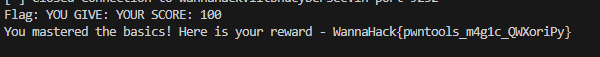<br>
**FLAG**: WannaHack{pwntools_m4g1c_QWXoriPy}

## Guess
Need to guess the correct number in just 30 tries. Use binary search to do so.<br>
```python
from pwn import *

# Connect to the remote service
host = 'wannahack.iitbhucybersec.in'
port = 33266
conn = remote(host, port)

print(conn.recv(1024).decode()) 

low = 1
high = 100000000
tries = 0

# Start guessing
while tries < 30:
    guess = (low + high) // 2 
    conn.sendline(str(guess)) 
    print(f"Guessing: {guess}")

    feedback = conn.recv(1024).decode()
    print(feedback)

    if "GO HIGHER" in feedback.upper():
        low = guess + 1
    elif "GO LOWER" in feedback.upper(): 
        high = guess - 1
    elif "CORRECT" in feedback.upper(): 
        print("Guessed the correct number!")
        print("Server feedback:", feedback) 

    tries += 1

while True:
    try:
        feedback = conn.recv(1024).decode()
        if not feedback:
            break  
        print(feedback) 
    except Exception as e:
        print(f"Error while receiving data: {e}")
        break

conn.close()
```
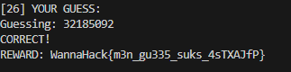<br>
**FLAG**: WannaHack{m3n_gu335_suks_4sTXAJfP}

